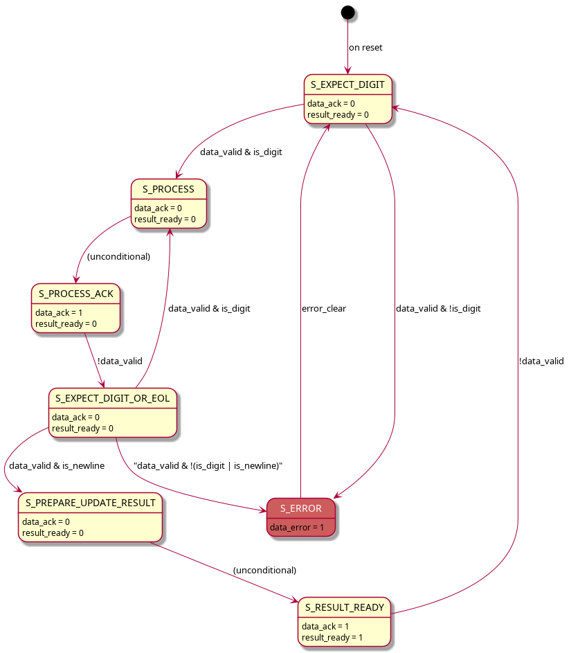
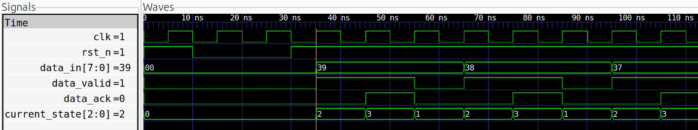

Advent of FPGA - A Jane Street Challenge - 2025
===============================================

Over the last few years I have used the great Advent of Code initiative to learn (or, better, to start learning) new languages.
This year I discovered (a bit late) the Jane Street side quest and so, since I have been an HDL beginner for too long... here I am.


# Overview

This is a [SystemVerilog implementation](verilog) of AOC Day 3, Part 1 (https://adventofcode.com/2025/day/3).
My first implementation was in [Rust](rust), my learning language for this year.
To prepare the SystemVerilog version, I simplified the initial Rust algorithm with a new [Python](python) version and then, in the end, I wrote a lower-level version in [C](c).


# Architecture

The SystemVerilog version is a not-so-fancy, simple Moore FSM, with some very basic error checking and input synchronization.
It receives and processes one digit every 3 clock cycles, using valid/ack signals for input flow control.
Upon reception of the newline character, it computes the intermediate result in 3 clock cycles.
The `data_error` signal is asserted if an invalid input is detected or if an invalid internal state is detected.

## FSM diagram
  

# I/O Ports

| Port           | Direction | Width  | Description                                                                               |
|----------------|-----------|--------|-------------------------------------------------------------------------------------------|
| `clk`          | Input     | 1-bit  | Main clock                                                                                |
| `rst_n`        | Input     | 1-bit  | Active-low reset                                                                          |
| `data_in`      | Input     | 8-bit  | Incoming ASCII character                                                                  |
| `data_valid`   | Input     | 1-bit  | Asserted by the sender when `data_in` contains a valid character                          |
| `data_ack`     | Output    | 1-bit  | Asserted by the module to acknowledge the data                                            |
| `result`       | Output    | 32-bit | The result value accumulated from input received since the last reset                     |
| `result_ready` | Output    | 1-bit  | Asserted by the module when `result` is ready to be read                                  |
| `error_clear`  | Input     | 1-bit  | Resets the FSM state after an error condition                                             |
| `data_error`   | Output    | 1-bit  | Asserted if the module receives an invalid character or detects an invalid internal state |


# Simulation

The project can be built and simulated using `make`:

- `make all`
  Compiles the DUT [`part1.sv`](verilog/part1.sv) and its testbench [`tb_part1.sv`](verilog/tb_part1.sv), along with [`sim_main.cpp`](verilog/sim_main.cpp), then launches the simulation and produces `waveform.vcd`.

> [!IMPORTANT]
> `tb_part1.sv` gets the input stream from the file [`input.txt`](verilog/input.txt) in its directory.
> The provided file contains [example data from the problem](https://adventofcode.com/2025/day/3).
> Replace it with the desired test data.

- `make waves`
  Opens `waveform.vcd` with `gtkwave`.

- `make diagrams`
  Produces FSM diagrams with PlantUML from `part1_fsm.puml`.


## Startup timing: reset followed by two input cycles

<p>Low res</p>

```
              +---+   +---+   +---+   +---+   +---+   +---+   +---+   +---+   +---+   +---+   +
clk           |   |   |   |   |   |   |   |   |   |   |   |   |   |   |   |   |   |   |   |   |
                  +---+   +---+   +---+   +---+   +---+   +---+   +---+   +---+   +---+   +---+
              XXXX+-------+               +-----------------------------------------------------
rst_n         XXXX|       |               |
              XXXX+       +---------------+
              XXX\ /                         \ /                     \ /                     \ /
data_in[7:0]  XXX X             0             X          33           X          31           X
              XXX/ \                         / \                     / \                     / \
              XXXX+                           +---------------+       +---------------+       +
data_valid    XXXX|                           |               |       |               |       |
              XXXX+---------------------------+               +-------+               +-------+
              XXXX+                                   +-------+               +-------+
data_ack      XXXX|                                   |       |               |       |
              XXXX+-----------------------------------+       +---------------+       +--------
                 \ /                         \ /     \ /     \ /     \ /     \ /     \ /     \ /
current_state     X            0              X   2   X   3   X   1   X   2   X   3   X   1   X
                 / \                         / \     / \     / \     / \     / \     / \     / \
                  |                           |       |       |
                  S_EXPECT_DIGIT              |       |       S_PROCESS_ACK
                                              |       S_PROCESS
                                              S_EXPECT_DIGIT_OR_EOL
```

<p>High res</p>

  


# Improvements

- The FSM could be easily improved by using a fully synchronous protocol to transfer data, but this would be trickier to test on real hardware.
- Another performance improvement could come from assuming the input data is preloaded into RAM, but this feels a bit like cheating, since AOC problems always involve reading the input as the very first step.
- The `error_clear` line is mostly useless, since a device reset would achieve the same result, but having two separate ports felt slightly cleaner.
- All error management could be removed, but error detection made validation easier and makes the device look somewhat more professional.


# Preparatory solutions (in chronological order)

## [Rust](rust)
- Build
```
cargo build --release
```
- Run
```
cargo run --release path/to/input.txt
```

## [Python](python)
- Run
```
python3 ./part1.py path/to/input.txt
```

## [C](c)
- Build
```
make
```
- Run
```
./part1 path/to/input.txt
```


# Tools used

- Verilator 5.042 2025-11-02 rev v5.042-51-gd91574507 (built locally)
- GTKWave Analyzer v3.3.116
- gcc 14.2.0
- GNU Make 4.3
- Rust 1.91.1
- Python 3.12.3
- PlantUML Version 1.2020.02
- Neovim 0.11.3 (built locally) + verible v0.0-4051-g9fdb4057

# License

All the code in this repository is released under the [MIT License](../LICENSE)

